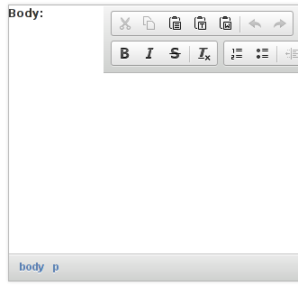
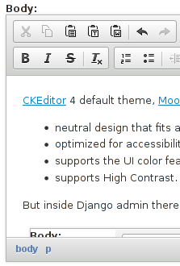

[CKEditor](https://ckeditor.com/) 4 default theme, [mOOno](https://ckeditor.com/cke4/addon/moono),
is very nice and has a good set of features:

 * neutral design that fits all situations;
 * optimized for accessibility, using [WAI-ARIA](https://en.wikipedia.org/wiki/WAI-ARIA)
   standards for contrast;
 * supports the UI color feature;
 * supports High Contrast.

But inside Django admin there is a little layout problem:



To fix this issue you may use the following css snippet:

```css
div>.cke_chrome {
    width: 100%;
    padding: 0!important;
    clear: both;
}
```

The result is this:


